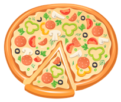

# Ontology: Pizza.owl using Protégé

Practice building pizza.owl ontology using Protege modeling tool, base on [Michael DeBillis](https://www.linkedin.com/in/michael-debellis-85329/)' great guide.

[Here](https://www.michaeldebellis.com/post/protegetutorialyoutubeplaylist) you can find the post by Michael in his site; and the [introduction](https://www.michaeldebellis.com/post/new-protege-pizza-tutorial) of the guide.

## About this repository

The repository is regularly synced to Gitee:

- Link of Repository in Github: https://github.com/yasenstar/protege_pizza
- Link of Repository in Gitee: https://gitee.com/yasenstar/protege_pizza

## Structure of pizza.owl

Refer to the [mindmap file](pizza.owl%20tutorial.mm) here (note: get FreePlane to open the mindmap):

## Ontologies inside Semantics Concept

Source from post of [Malcolm Chirholm Ph.D.](https://www.linkedin.com/in/malcolmchisholm?miniProfileUrn=urn%3Ali%3Afs_miniProfile%3AACoAAALGOX0Byp8PZaGgklIEBK0daX9A9WtjIQM&lipi=urn%3Ali%3Apage%3Ad_flagship3_feed%3BYN15qj%2FISRyjIwyAgQtkjQ%3D%3D)

| Terms          | Description                                                                                                         |
| -------------- | ------------------------------------------------------------------------------------------------------------------- |
| Ontologies     | Each is a "view" of the business world (and business information) that is required to meet a specific business need |
| Business Rules | Atomic units of logic that govern behavior of concepts and relationships                                            |
| Relationships  | Other business relationships outside taxonomies and hierarchies                                                     |
| Hierarchies    | How individual things (instances) are associated at multiple levels for specific businees needs                     |
| Taxonimies     | The relationships of general with specific concepts                                                                 |
| Definitions    | Descriptions of the concepts identified by the terms                                                                |
| Terms          | The specialized terms used in the business, with homonyms, synonyms, and universes of discourse identified          |

## Learn Ontologies from pizza.owl

Thanks for Michael DeBellis's great tutorial on pizza.owl, which is helping to understand the key concepts of ontology and also a way of building practices.

This repository is tracking my hands-on modeling the pizza.owl in step-by-step manner, and you can find the snapshot ontology model files in every step so that you can start your practice from any point.

## Why Protégé?

Check [Protege Website](https://protege.stanford.edu/), you can find below statements:

*Protégé’s plug-in architecture can be adapted to build both simple and complex ontology-based applications. Developers can integrate the output of Protégé with rule systems or other problem solvers to construct a wide range of intelligent systems. Most important, the Stanford team and the vast Protégé community are here to help.*

I'm using Protégé to learn pizza.owl and also practice the modeling skill here.

Some reference quick link about Protégé:

- [WebProtégé](http://webprotege.stanford.edu/)
- [Download Windows Version 5.6.1](https://protege.stanford.edu/software.php), also have Java package for platform independent installating.
- [Protégé wiki](https://protegewiki.stanford.edu/wiki/Main_Page)
- [Protégé in Github](https://github.com/protegeproject), from here you can get latest version

## Pizza.OWL Modeling Video List 

Please follow my [Youtube Channel](https://www.youtube.com/channel/UCTshmTJGpJunOz23vCEhzWg).

| Video Title | Link in YouTube | Link in bilibili |
| --- | --- | --- |
| 01 - Introduction | [link](https://youtu.be/l0PZhqmTwfM) | [link](https://www.bilibili.com/video/BV1Tu4y1J75J/) |
| 02 - Practice Guide Document Structure | [link](https://youtu.be/eWx9_zJkiUY) | [link](https://www.bilibili.com/video/BV1684y1X7NG/) |
| 03 - Installing Protege and understand Protege User Interface | [link](https://youtu.be/Q6eq-cWBpfQ) | [link](https://www.bilibili.com/video/BV1JN41137Cq/) |

Below are videos published in YouTube already, will publish to bilibili soon and links will be added into above table then:

- [04 - Create new Ontology (exercise 01~03)](https://youtu.be/IMjKcx93ens)
- [05 - Named Classes (section 4.1, exercise 04)](https://youtu.be/QqVrFxaEFrI)
- [06 - Using a Reasoner (section 4.2, exercise 05)](https://youtu.be/TKMW5udKzIM)
  - [HermiT OWL Reasoner](http://www.hermit-reasoner.com/)
  - [Pellet OWL DL reasoner for Java, from Stardog](https://github.com/stardog-union/pellet)
- [07 - Disjoint Classes (section 4.3, exercise 06)](https://youtu.be/g7aoDsS5kSI)
- [08 - Understand RDF Ontology File Structure](https://youtu.be/qjer-vEKMNg)
- [09 - Using Create Class Hierarchy (section 4.4, exercise 07~08)](https://youtu.be/FQdjYQMqfBI)
- [10 - Object Properties](https://youtu.be/4DfR06bI500)
- [11 - Inverse Properties](https://youtu.be/cqQ8uqRjhNQ)
- [12 - OWL Object Property Characteristics](https://youtu.be/bYx0LPxXAk8)
- [13 - OWL Property Domains and Ranges](https://youtu.be/gE_kKvS-R5o)
- [14 - Existential Restriction](https://youtu.be/KG4D5PEhCKE)
- [15 - Exercise 14: Create Subclasses of Pizza: NamedPizza and MargheritaPizza](https://youtu.be/tN5l1JjVVMw)
- [16 - Exercise 15: Create Restrictions that define a MargheritaPizza](https://youtu.be/zpw9knBt8Zw)
- [17 - Exercise 16: Create AmericanaPizza by Cloning MargheritaPizza and Adding Additional Restrictions](https://youtu.be/sBm0Lz0vnP4)
- [18 - Exercise 17: Create AmericanaHotPizza and SohoPizza](https://youtu.be/qISxhDleqf8)
- [19 - Exercise 18: Make Subclasses of NamedPizza Disjoint](https://youtu.be/TZdaSRDWKm8)
- [20 - Exercise 19: Add a Probe Class called ProbeInconsistentTopping](https://youtu.be/Gq3-zWinu1c)
- [21 - Primitive Classes - Exercise 20: Create the CheesyPizza class](https://youtu.be/Bkb7DdBWGNw)
- [22 - Exercise 21: Convert CheesyPizza from a Primitive Class to a Defined Class](https://youtu.be/x5_83xGCrZc)
- [23 - Universal Restrictions (exercise 22: Create a Defined Class called VegetarianPizza)](https://youtu.be/rO195cLbwS4)
- [24 - Automated Classification and Open World Reasoning (exercise 23)](https://youtu.be/s5wx6vQg650)
- [25 - Defining an Enumerated Class (exercise 24)](https://youtu.be/ZNodw2fYxy0)
- [26 - Adding Spiciness as a Property (Exercise 25: Create and Use the hasSpiciness Property)](https://youtu.be/ClmDiKU1VlY)
- [27 - Cartinality Restrictions (exercise 26: Create an InterestingPizza that has at least three toppings)](https://youtu.be/efCHZ0q771A)
- [28 - Defining a Data Property (Exercise 27: Create a Datatype Property called hasCaloricContent)](https://youtu.be/0Y1-SQ_sU9g)
- [29 - Customize Protege UI (exercise 28 and 29)](https://youtu.be/fTrWQE6y3Os)
- [30 -Customize Protege UI (exercise 30)](https://youtu.be/bun_1B5T27M)
- [31 - Create a Datatype Restriction that Every Pizza hasCaloricContent](https://youtu.be/QUGmmfKWdHE)
- [32 - Create a HighCaloriePizza Defined Class](https://youtu.be/fqpcYCD4rRE)
- [33 - Adding Order to an Enumerated Class](https://youtu.be/5m2qRSrUAe8)
- [34 - Names and Namespaces in Ontology (demo only)](https://youtu.be/7PPJPoJCFfE)
- [35 - Chapter 8 A Larger Ontology with some Individuals](https://youtu.be/l-mY5urfE7k)
- [36 - Ontology Query using DL (Exercise 33: Try Some Description Logic Queries)](https://youtu.be/3cwlMMQSPcA)
- [37 - Ontology Query using SPARQL](https://youtu.be/kK5iLNNqZnc)
- [38 - Exercise 34: Write Your First SWRL Rule](https://youtu.be/bk5KrQIs6eU)
- [39 - SWRL Tip Remove Ontology Prefixes from SWRL Rules](https://youtu.be/1OrvhURYYA0)
- [40 - Exercise 35: Write Another SWRL Rule](https://youtu.be/dBrBWqkuSog)
- [41 - SQWRL Rules ex36 Write a SQWRL Rule](https://youtu.be/eAZVmZa1Qpo)
- [42 - SHACL](https://youtu.be/hatOoDLN7CE)
- [43 - WebProtege (Part 1)](https://youtu.be/zPSFoPY9vGM)
- [44 - WebProtege (Part 2)](https://youtu.be/xAOgKmHoeeQ)
- [45 - WebVOWL](https://youtu.be/2B5tvHAZICs)

## Ontology Querying

### Description Logic Query (DL)

- [An Introduction to Description Logics and Query Rewriting](https://www.dcs.bbk.ac.uk/~roman/papers/RW12014.pdf), also available in the [repository folder](ontology_query/DL/RW12014_An%20Introduction%20to%20Description%20Logics%20and%20Query%20Rewriting.pdf)
- [A Description Logic Primer](https://arxiv.org/pdf/1201.4089.pdf)
- [Reasoning in Description Logics](ontology_query/DL/Reasoning%20in%20Description%20Logics.pdf)

### SQWRL

- [SQWRL_a_query_language_for_OWL](ontology_query/SQWRL/SQWRL_a_query_language_for_OWL.pdf)

## Visualized our Ontology Model

View [here](https://service.tib.eu/webvowl/#iri=https://yasenstar.github.io/protege_pizza/MyPizzaTutorial.rdf) which powered by [WebVOWL](http://vowl.visualdataweb.org/webvowl.html).

---

If you find the information here is interesting or useful, please consider [**donate $1 dollar**](https://paypal.me/zhaoxiaoqi/1) (secure Paypal link) for a coffee, thanks and enjoy!

Hope you can get nice experience thorugh following this journey together with me, any questions are welcome to [reach_me_in_email](mailto:xiaoqizhao@outlook.com?subject=Protege-pizza.owl) or check my [LinkedIn](https://www.linkedin.com/in/xiaoqi-zhao-03715614/), thank you!  (2023)